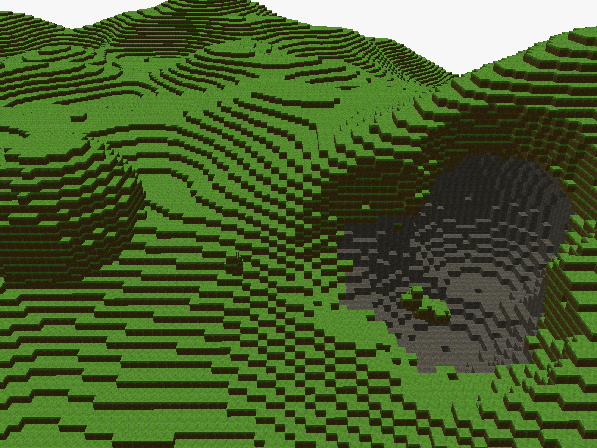

# minecraft clone

To run:

- `cargo run --release`
- `cargo run --release --features reload` (to hot reload shader.wgsl)
- `wasm-pack build --target web` to compile the web version in `./index.html`
- web version: https://www.obkircher.xyz/minecraft-clone.html

Controls:

- `mouse click`/`esc` to capture and release the mouse
- `wasd` for movement
- `left mouse button` remove block
- `right mouse button` place block
- `q` explosion
- `e` anti-explosion
- `p` toggle printing of statistics

